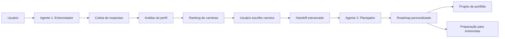
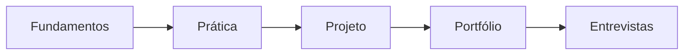

<div align="center">

# 🤖 Copilot Prompts — Agentes de Carreira em Tecnologia

Coleção de prompts para agentes de inteligência artificial capazes de entrevistar candidatos, identificar perfis profissionais e gerar trilhas personalizadas de estudos em tecnologia.


</div>

---

## 📌 Sobre o projeto

Este repositório documenta uma experiência de criação de agentes especializados em orientação de carreira na área de tecnologia.

A solução foi estruturada em dois agentes com responsabilidades diferentes:

1. um entrevistador responsável por conhecer o usuário e sugerir carreiras;
2. um planejador responsável por montar uma trilha de estudos personalizada.

A proposta é demonstrar como prompts estruturados podem orientar modelos de linguagem para executar processos com várias etapas, regras, critérios de decisão e transferência de contexto entre agentes.

> Este projeto contém prompts e exemplos de respostas. Ele não representa uma aplicação completa com backend, banco de dados ou integração automatizada entre agentes.

---

## 🎯 Objetivos

Os principais objetivos do projeto são:

* praticar engenharia de prompts;
* criar agentes com responsabilidades específicas;
* estruturar conversas em várias etapas;
* coletar informações progressivamente;
* estabelecer regras de comportamento;
* criar critérios de decisão;
* realizar transferência de contexto entre agentes;
* gerar recomendações personalizadas;
* desenvolver planos de estudos;
* documentar testes e resultados.

---

## 🧩 Arquitetura dos agentes



---

## 🤖 Agente 1 — Entrevistador de carreira

O primeiro agente atua como entrevistador especializado em identificar interesses, disponibilidade, experiência e objetivos profissionais.

Sua missão é conduzir uma entrevista estruturada e sugerir carreiras compatíveis com o perfil informado.

### Informações coletadas

O agente procura identificar:

* interesses;
* motivações;
* experiência prévia;
* tempo disponível para estudar;
* preferência por pessoas, dados ou código;
* objetivo profissional;
* assuntos técnicos de interesse;
* experiências anteriores aproveitáveis.

---

## 📝 Fluxo da entrevista

O agente realiza sete perguntas.

### Pergunta 1

```text
O que mais te atrai em tecnologia:
resolver problemas, criar produtos ou entender sistemas?
```

### Pergunta 2

```text
Você já tem experiência na área de tecnologia
ou está começando do zero?
```

### Pergunta 3

```text
Quantas horas por semana você consegue
dedicar aos estudos?
```

### Pergunta 4

```text
Você prefere lidar mais com pessoas,
dados ou código?
```

### Pergunta 5

```text
Qual é seu objetivo principal:
primeiro emprego, transição ou crescimento profissional?
```

### Pergunta 6

```text
Quais tecnologias ou assuntos mais despertam seu interesse?
```

### Pergunta 7

```text
Existe alguma experiência anterior que você deseja
aproveitar na nova carreira?
```

---

## ⚙️ Regras do Agente 1

O prompt estabelece regras importantes:

* fazer apenas uma pergunta por vez;
* aguardar a resposta antes de continuar;
* finalizar a entrevista após sete perguntas;
* não gerar o plano de estudos;
* sugerir três carreiras;
* não informar salários específicos;
* transferir o contexto para o segundo agente.

Essas regras ajudam a evitar:

* perguntas excessivas;
* respostas desorganizadas;
* mistura de responsabilidades;
* interrupção prematura da entrevista;
* recomendações sem contexto suficiente.

---

## 📊 Matriz de decisão

Após a entrevista, o agente avalia as possíveis carreiras utilizando quatro critérios:

| Critério                               | Pontuação |
| -------------------------------------- | --------: |
| Afinidade com interesses               |     0 a 5 |
| Demanda de mercado                     |     0 a 5 |
| Tempo de preparação inicial            |     0 a 5 |
| Aproveitamento de experiência anterior |     0 a 5 |

A pontuação máxima prevista é:

```text
20 pontos
```

O agente deve selecionar as três carreiras com melhor resultado.

---

## 🏆 Formato da recomendação

Cada carreira recomendada deve apresentar:

* posição no ranking;
* pontuação;
* justificativa;
* vantagens;
* desafios;
* contexto de mercado.

Exemplo:

```text
🥇 1º lugar: Desenvolvedor Back-end — 18/20

Por que combina com você:
Seu perfil demonstra afinidade com lógica, código
e resolução de problemas.

Vantagens:
- Ampla aplicação em sistemas
- Possibilidade de especialização

Desafios:
- Curva de aprendizado inicial
- Necessidade de prática constante
```

---

## 🔄 Handoff para o Agente 2

Após o usuário escolher uma carreira, o primeiro agente deve transferir:

* carreira escolhida;
* horas disponíveis;
* nível de experiência;
* objetivo profissional;
* preferência de trabalho;
* interesses técnicos;
* experiências anteriores.

Exemplo de estrutura:

```text
PERFIL DO CANDIDATO

Carreira escolhida: Desenvolvedor Back-end
Disponibilidade: 5 a 6 horas por semana
Nível: Iniciante
Objetivo: Transição de carreira
Preferência: Código
Interesses: Lógica, sistemas e aplicações
```

---

## 🧭 Agente 2 — Planejador de carreira

O segundo agente recebe os dados coletados durante a entrevista e cria um plano de desenvolvimento profissional.

O resultado pode incluir:

* visão geral da profissão;
* mapa de competências;
* tecnologias recomendadas;
* cronograma de estudos;
* projeto de portfólio;
* preparação para entrevistas;
* próximos passos.

---

## 🧠 Mapa de competências

O plano pode separar as competências em categorias.

### Competências essenciais

* lógica de programação;
* algoritmos;
* estruturas de dados;
* orientação a objetos;
* Git e GitHub;
* resolução de problemas.

### Competências complementares

* banco de dados;
* testes;
* documentação;
* noções de interface;
* trabalho em equipe;
* comunicação técnica.

### Ferramentas

As tecnologias devem ser escolhidas conforme a carreira.

Exemplo para backend:

* Java;
* Python;
* C#;
* Node.js;
* SQL;
* Git;
* APIs REST.

Exemplo para desenvolvimento de jogos:

* C#;
* Unity;
* Git;
* modelagem básica;
* física de jogos.

> O agente deve evitar recomendar várias carreiras ou stacks conflitantes dentro do mesmo plano.

---

## 📅 Roadmap personalizado

O projeto apresenta um exemplo de plano dividido em etapas.



### Etapa 1 — Fundamentos

* lógica;
* variáveis;
* condicionais;
* laços;
* funções;
* ambiente de desenvolvimento.

### Etapa 2 — Estruturas e orientação a objetos

* arrays;
* coleções;
* classes;
* objetos;
* encapsulamento;
* herança.

### Etapa 3 — Ferramentas

* Git;
* GitHub;
* terminal;
* depuração;
* documentação.

### Etapa 4 — Especialização

O conteúdo depende da carreira escolhida.

### Etapa 5 — Portfólio

* projeto funcional;
* código no GitHub;
* README;
* exemplos de uso;
* documentação.

---

## 🚀 Projeto de portfólio

O plano registrado no repositório sugere um quiz interativo sobre filmes.

### Funcionalidades

* perguntas;
* alternativas;
* pontuação;
* feedback;
* resultado final.

### Entregáveis

* código funcional;
* interface simples;
* repositório público;
* README;
* instruções de execução.

### Critérios de aceitação

* usuário consegue concluir o quiz;
* pontuação é calculada corretamente;
* resultado é exibido;
* aplicação pode ser executada conforme a documentação.

> O projeto de portfólio deve estar alinhado à carreira escolhida. Um quiz web pode ser adequado para desenvolvimento frontend ou software, mas não demonstra profundamente uma trilha de backend.

---

## 💬 Preparação para entrevistas

O planejador também pode sugerir perguntas de entrevista.

### Projeto prático

```text
Você já desenvolveu algum projeto?
```

A resposta deve apresentar:

* problema;
* solução;
* tecnologias;
* dificuldades;
* resultado.

### Linguagem principal

```text
Qual linguagem você conhece melhor?
```

O candidato deve explicar:

* por que escolheu a linguagem;
* onde utilizou;
* conceitos aprendidos;
* projetos desenvolvidos.

### Resolução de bugs

```text
Como você lida com erros?
```

Uma resposta pode mencionar:

* leitura da mensagem;
* reprodução do problema;
* depuração;
* documentação;
* testes;
* validação da correção.

---

## 🛠️ Tecnologias e conceitos

| Tecnologia ou conceito | Aplicação                      |
| ---------------------- | ------------------------------ |
| Microsoft Copilot      | Execução ou teste dos prompts  |
| IA generativa          | Geração de respostas           |
| Prompt Engineering     | Estruturação dos agentes       |
| Multiagentes           | Separação de responsabilidades |
| Handoff                | Transferência de contexto      |
| Markdown               | Documentação                   |
| GitHub                 | Versionamento                  |
| DIO                    | Contexto educacional           |

---

## 📁 Estrutura atual

```text
copilot-prompts/
│
├── AGENT 1 - Entrevistador de Carreira em Tecnologia
├── AGENT 2 - Planejador de Carreiras
└── readme.md
```

---

## 📁 Estrutura recomendada

```text
copilot-prompts/
│
├── agents/
│   ├── career-interviewer.md
│   └── career-planner.md
│
├── examples/
│   ├── backend-profile.md
│   └── software-profile.md
│
├── tests/
│   └── test-cases.md
│
├── docs/
│   ├── architecture.md
│   └── limitations.md
│
└── README.md
```

Essa estrutura separa:

* prompts;
* resultados;
* testes;
* documentação;
* exemplos de conversa.

---

## 🧪 Casos de teste recomendados

| Cenário                   | Resultado esperado                     |
| ------------------------- | -------------------------------------- |
| Iniciante com pouco tempo | Plano reduzido e realista              |
| Usuário experiente        | Trilha sem repetir fundamentos básicos |
| Perfil voltado a dados    | Carreiras relacionadas a dados         |
| Perfil voltado a pessoas  | Opções compatíveis com interação       |
| Respostas incompletas     | Solicitação de esclarecimento          |
| Carreira escolhida        | Plano alinhado somente à escolha       |
| Interesses conflitantes   | Explicação dos trade-offs              |

---

## ⚠️ Limitações atuais

O projeto possui algumas limitações:

* não existe integração automática entre os agentes;
* o handoff é representado em texto;
* não há aplicação executável;
* não existem testes automatizados;
* as recomendações de mercado podem ficar desatualizadas;
* a matriz de pontuação depende da avaliação do modelo;
* não existe validação externa das carreiras sugeridas;
* o README mistura resultados de perfis diferentes;
* não há separação clara entre prompt e resposta;
* o nome do arquivo README utiliza letras minúsculas.

---

## 🔐 Cuidados importantes

Um agente de orientação de carreira deve evitar:

* garantir contratação;
* prometer salários;
* apresentar uma carreira como única opção;
* ignorar limitações pessoais;
* inventar dados de mercado;
* coletar informações pessoais desnecessárias;
* tratar uma recomendação como diagnóstico definitivo.

As recomendações devem ser apresentadas como apoio à decisão.

---

## 🗺️ Melhorias futuras

O projeto poderá evoluir com:

* separação dos prompts em arquivos Markdown;
* inclusão de variáveis de entrada;
* formato estruturado para o handoff;
* respostas em JSON;
* casos de teste;
* avaliação de consistência;
* histórico de versões dos prompts;
* integração com Copilot Studio;
* aplicação web;
* armazenamento das entrevistas;
* exportação do roadmap;
* personalização por disponibilidade;
* atualização periódica das trilhas.

---

## 📚 Aprendizados desenvolvidos

Durante o projeto foram praticados:

* engenharia de prompts;
* definição de persona;
* definição de missão;
* criação de regras;
* entrevista progressiva;
* análise de perfil;
* matriz de decisão;
* geração de recomendações;
* transferência de contexto;
* separação de responsabilidades;
* planejamento educacional;
* documentação de agentes.

---

## 🎓 Contexto educacional

Projeto desenvolvido durante estudos relacionados a agentes de inteligência artificial, Microsoft Copilot e engenharia de prompts.

O repositório registra a criação de um fluxo de orientação profissional dividido entre entrevistador e planejador.

---

## 👨‍💻 Autor

Desenvolvido por **Ernesto — ONestoDev**.

[](https://github.com/ONestoDev)

---

## 📄 Créditos e licença

Este projeto possui finalidade educacional.

Microsoft Copilot e DIO são marcas pertencentes aos respectivos proprietários.
